# Emotion Analyzer

Emotion Analyzer es una herramienta innovadora diseñada para analizar emociones en textos y detectar comportamientos basados en las emociones identificadas. Actualmente, estamos enfocados en la detección de una amplia gama de emociones, incluyendo signos de depresión y suicidio, pero nuestro objetivo es expandirnos continuamente para abarcar más emociones en el futuro. 🌟

## Tabla de contenidos

1. [Nombre](#Nombre)
2. [Descripción](#descripción)
3. [Arquitectura](#Arquitectura)
4. [Proceso](#Proceso)
5. [Funcionalidades](#Funcionalidades)
6. [Estado del proyecto](#EstadoDelProyecto)
7. [Agradecimientos](#Agradecimientos)

## Nombre

Emotion Analyzer

## Descripción

Emotion Analyzer es una aplicación que utiliza técnicas avanzadas de procesamiento de lenguaje natural (NLP) para analizar publicaciones, comentarios y otros textos. La idea es proporcionar una herramienta que pueda ser utilizada en foros, redes sociales y otras plataformas para identificar emociones subyacentes y comportamientos potencialmente preocupantes.

### ¿Por qué es importante?

En el mundo digital de hoy, las personas comparten sus pensamientos y sentimientos en línea más que nunca. Emotion Analyzer tiene el potencial de ser una herramienta valiosa para moderadores de foros, administradores de redes sociales y cualquier persona interesada en comprender mejor las emociones expresadas en los textos. Al identificar tempranamente signos de depresión y suicidio, así como otras emociones, podemos intervenir y ofrecer ayuda antes de que sea demasiado tarde. Esto puede salvar vidas y proporcionar apoyo a quienes más lo necesitan. 🌍❤️

## Arquitectura

## Proceso

### Fuente del Dataset

Para entrenar nuestros modelos, utilizamos un conjunto de datos de textos etiquetados que contienen indicios de diversas emociones. Las fuentes del dataset incluyen:

- [Kaggle: Suicide and Depression Detection](https://www.kaggle.com/code/chanchal24/suicide-and-depression-detection/input)
- Datos extraídos de Twitter, que fueron clasificados manualmente.

### Limpieza de Datos
realmente no se utilizo una limpieza de datos ya que las fuentes fueron bastante certeras y minimalistas a la hora de construir sus dataseets, acontinuacion en cambio mostramos el flujo de datos de cada dataseet

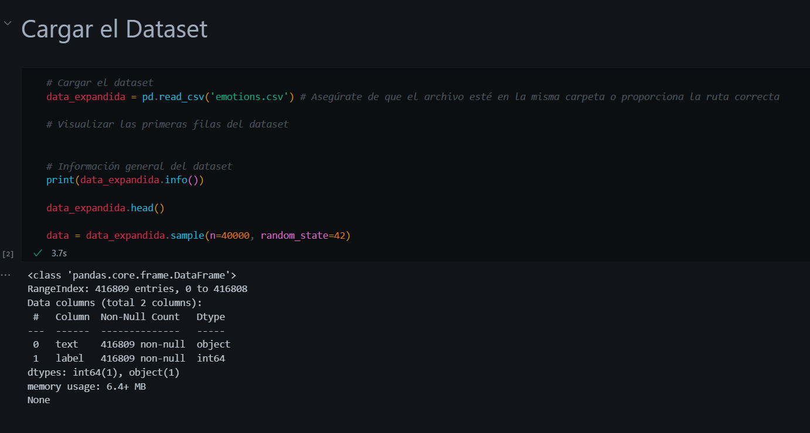
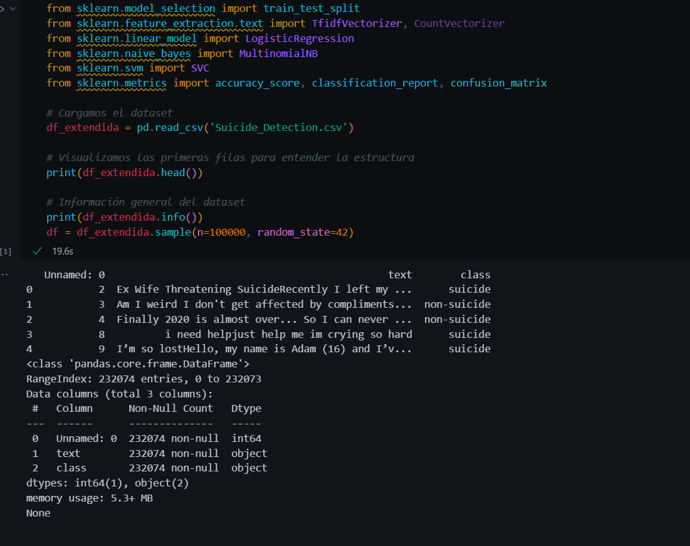

### Manejo de Excepciones/Control de Errores

Implementamos diversas técnicas para manejar excepciones y controlar errores durante el preprocesamiento y análisis de los datos.

### Estadísticos

Incluimos análisis estadísticos y gráficos para entender mejor la distribución de los datos y el rendimiento de los modelos.

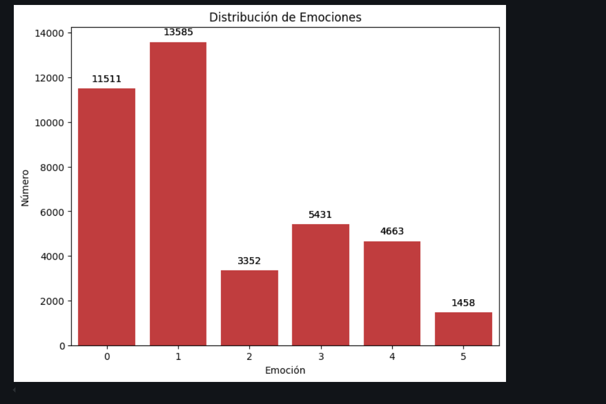
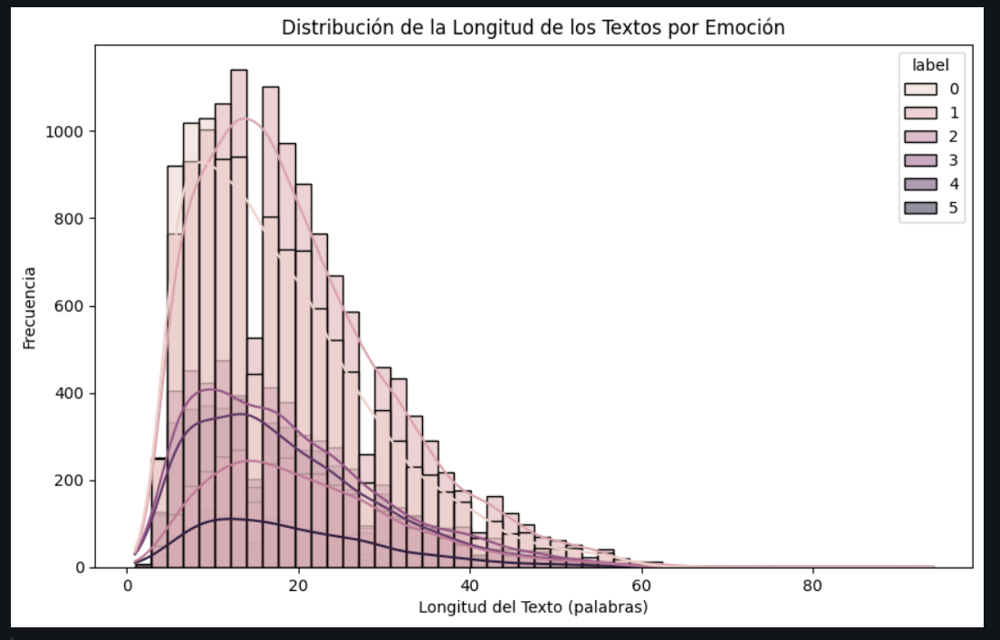
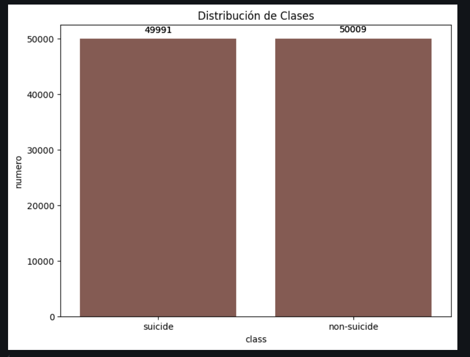
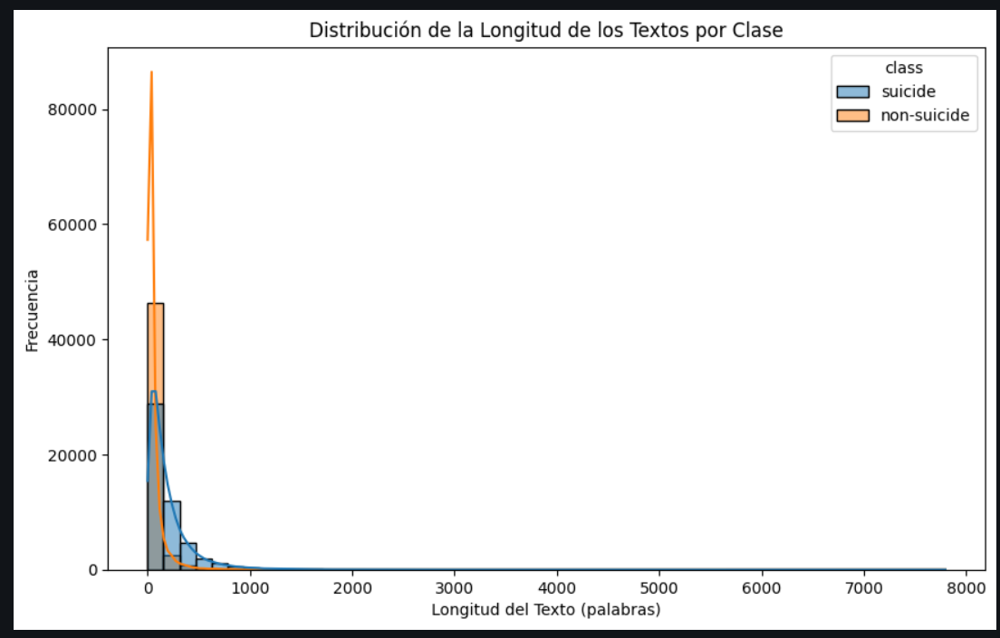

## Funcionalidades
### Entrenamiento de los modelos:
- **Modelos**: Regresion Lineal, Naive bayes, SVM.
- **Arquitectura**:
  #### modelo de sentimientos:
  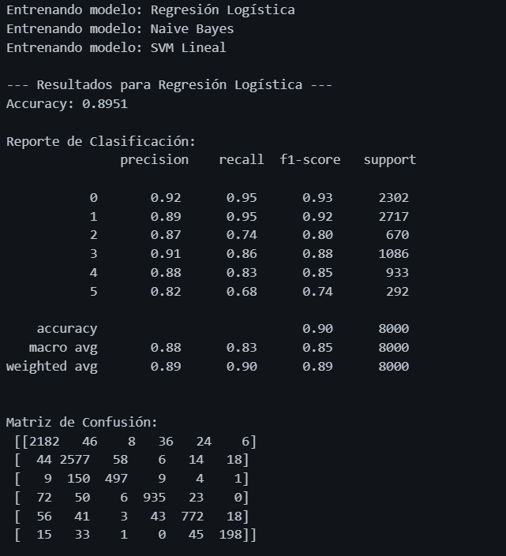
  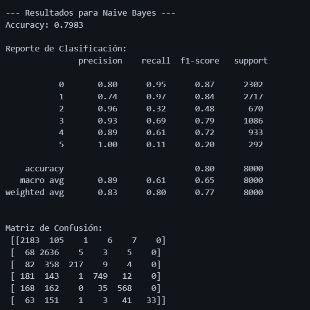
  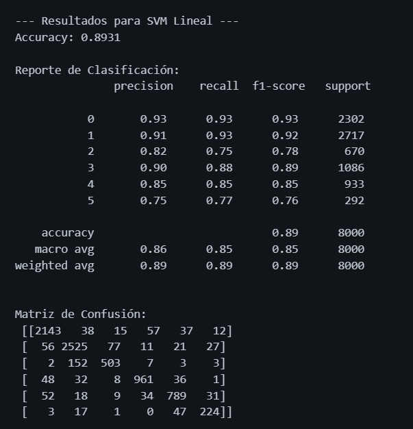
  #### modelo de depresion:
  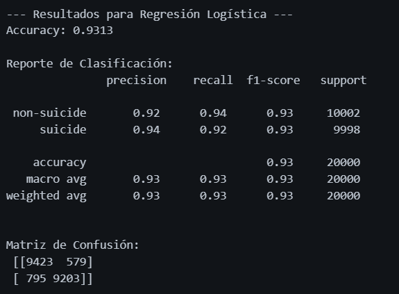
  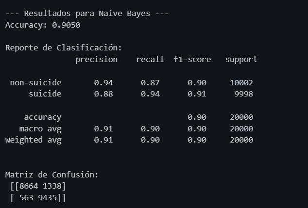
  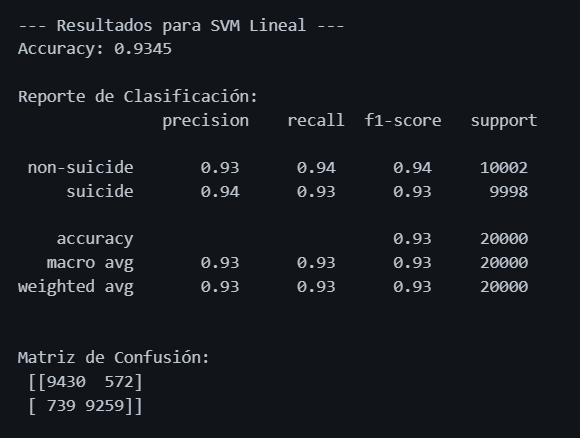
  

### Integración del Proyecto en una Página Web

Utilizamos Reflex para desarrollar una interfaz interactiva que permite a los usuarios ingresar texto y obtener una predicción en tiempo real.

- **Tecnología/Herramientas usadas**: Reflex, Python, Scikit-learn
- **Arquitectura**: 
  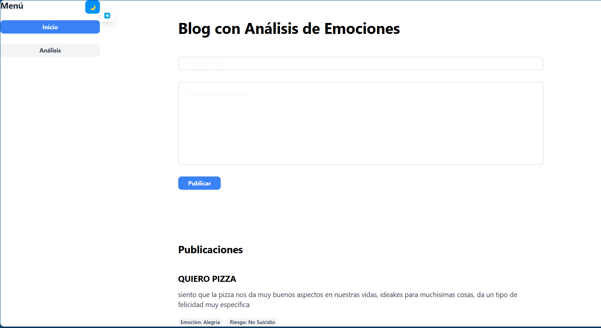

### Desarrollo de Interfaz Gráfica de Usuario

La interfaz gráfica de usuario es intuitiva y fácil de usar, permitiendo a los usuarios interactuar con la aplicación de manera eficiente.

- **Tecnología/Herramientas usadas**: Reflex, HTML, CSS, JavaScript
- **Arquitectura**: 
  

## Estado del Proyecto

Emotion Analyzer está en continuo desarrollo. Actualmente, hemos implementado la detección de varias emociones y estamos trabajando en mejorar la precisión y expandir las capacidades del modelo.

## Agradecimientos

Este proyecto ha sido desarrollado como parte del curso de Samsung Innovation Campus. Agradecemos a Samsung por la oportunidad y el apoyo brindado para llevar a cabo este proyecto. 🙌😊

---
